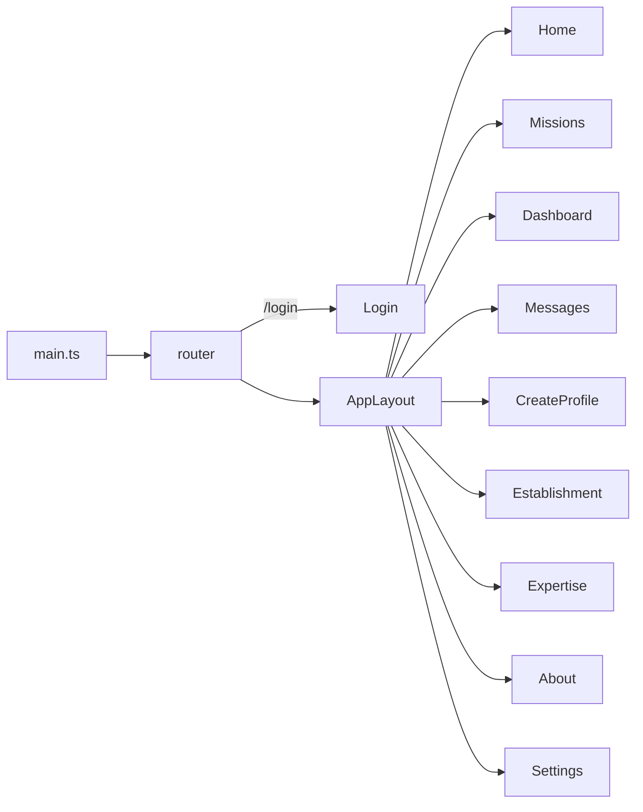
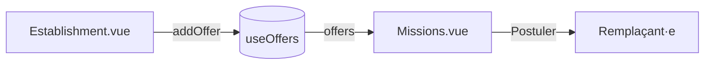
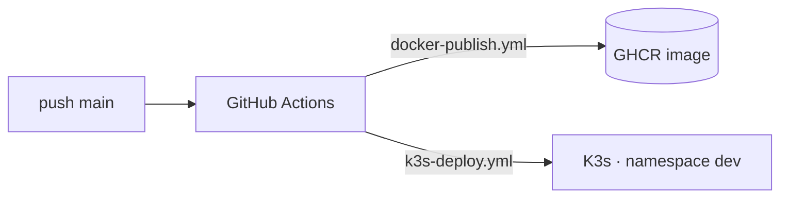

<div align="center">

# Allô Remplaçant — Frontend

**Plateforme de remplacements scolaires pour l'enseignement obligatoire vaudois (DGEO).**
Les remplaçant·e·s trouvent et postulent à des missions ; les établissements publient leurs offres.

[](https://vuejs.org/)
[](https://vite.dev/)
[](https://tailwindcss.com/)
[](https://www.typescriptlang.org/)
[](#-pwa)
[](LICENSE)

</div>

---

## Sommaire

- [Aperçu](#-aperçu)
- [Stack](#-stack)
- [Démarrage rapide](#-démarrage-rapide)
- [Scripts](#-scripts)
- [Structure du projet](#-structure-du-projet)
- [Architecture](#-architecture)
- [Thématisation](#-thématisation)
- [Données métier (VD)](#-données-métier-vd)
- [PWA](#-pwa)
- [Déploiement & CI/CD](#-déploiement--cicd)
- [Roadmap](#-roadmap)
- [Licence](#-licence)

---

## Aperçu

SPA Vue 3 qui couvre deux parcours sur **une seule base de code** :

| Parcours | Pages clés |
|---|---|
| **Remplaçant·e** | Accueil, Missions (catalogue + postuler), Tableau de bord, Messages, Créer un profil (dossier MIREO), Expertise |
| **Établissement** | Espace établissement (accès réservé → publication d'offres) |

Le tout multi-thème (5 thèmes dont *État de Vaud*), responsive, installable (PWA), et alimenté par les données officielles vaudoises (HarmoS, grilles horaires, établissements).

---

## Stack

| Domaine | Techno |
|---|---|
| Framework | Vue 3 (`<script setup>` + TypeScript) |
| Build | Vite 8 |
| Styles | Tailwind CSS **v4** (`@tailwindcss/vite`) + variables CSS |
| État partagé | Composables (`src/composables`) — pattern store léger |
| Routing | Vue Router 4 |
| Animations | GSAP + Lenis (smooth scroll) |
| Carte | Leaflet + OpenStreetMap (chargé à la demande) |
| Icônes | `lucide-vue-next` |
| Conteneur / Déploiement | Docker (Node → Nginx) · GHCR · Kubernetes (K3s) · GitHub Actions |

---

## Démarrage rapide

> Prérequis : **Node ≥ 20** et npm.

```bash
npm install        # installer les dépendances
npm run dev        # serveur de dev → http://localhost:5173
npm run build      # build de production (type-check + bundle) → dist/
npm run preview    # prévisualiser le build (nécessaire pour tester la PWA)
```

---

## Scripts

| Script | Rôle |
|---|---|
| `npm run dev` | Serveur Vite (exposé sur le réseau via `--host`) |
| `npm run build` | `vue-tsc -b` (vérif. de types) puis `vite build` |
| `npm run preview` | Sert le `dist/` localement (SW PWA actif) |
| `npm run lint` | ESLint avec `--fix` |
| `npm run format` | Prettier sur `src/` |

---

## Structure du projet

```
Frontend/
├── public/                     # Servi tel quel à la racine
│   ├── favicon.svg / .ico / *.png   # Favicons (logo « allô »)
│   ├── manifest.webmanifest    # Manifeste PWA
│   ├── sw.js                   # Service worker (offline)
│   └── icons/                  # Icônes d'app (192 / 512 / maskable)
├── src/
│   ├── pages/                  # 1 page = 1 route
│   │   ├── Home · Missions · Dashboard · Messages
│   │   ├── CreateProfile       # Dossier MIREO (remplaçant)
│   │   ├── Establishment       # Espace établissement (offres)
│   │   ├── Expertise · About · Settings · Login · NotFound
│   ├── components/
│   │   ├── AppLayout.vue        # Shell : nav (+ dropdown), Lenis, <RouterView>
│   │   ├── Footer · ThemeToggle · ToggleSwitch
│   │   ├── DoodleBackground.vue # Décor SVG dispersé (96 doodles)
│   │   ├── EstablishmentsMap.vue# Carte Leaflet (lazy)
│   │   └── GrilleHoraire.vue    # Grilles horaires officielles (repliable)
│   ├── composables/            # État partagé (« stores »)
│   │   ├── useTheme.ts          # Thème actif (5 thèmes, persistant)
│   │   ├── useOffers.ts         # Catalogue d'offres partagé
│   │   └── useEstablishment.ts  # Session établissement (accès réservé)
│   ├── data/
│   │   └── vaud.ts              # Années ↔ disciplines, grilles, établissements
│   ├── styles/                 # index → fonts + theme + globals + Tailwind
│   ├── assets/doodles/         # SVG décoratifs
│   ├── router/index.ts         # Routes (sous AppLayout, sauf /login)
│   └── main.ts                 # Point d'entrée (+ enregistrement SW)
├── index.html                  # Metas PWA, favicon, anti-flash de thème
├── vite.config.ts · Dockerfile · nginx.conf
```

---

## Architecture

**Coquille + routes.** Toutes les pages sont rendues dans `AppLayout` (nav + footer + smooth scroll) ; `/login` est autonome.



**Flux d'une offre** — un établissement publie, ça apparaît instantanément côté remplaçant grâce au store partagé `useOffers` :



**État partagé sans Pinia.** Chaque composable expose un `ref` à portée module (singleton) : importer le composable depuis plusieurs composants partage le même état. Persistance via `localStorage` (thème) ou `sessionStorage` (session établissement).

---

## Thématisation

5 thèmes définis en **variables CSS** dans [`src/styles/theme.css`](src/styles/theme.css) : `creme` (défaut), `nuit` (sombre chaud), `foret`, `lavande`, `vaud` (vert officiel).

- [`useTheme`](src/composables/useTheme.ts) applique une classe `theme-*` (+ `dark`) sur `<html>` et persiste le choix.
- Pour éviter le *flash* au chargement, le thème est appliqué avant le rendu via un script inline dans `index.html`.
- **Règle d'or** : les composants utilisent les *tokens* (`bg-card`, `text-foreground`, `text-primary`…), jamais des couleurs en dur — c'est ce qui rend les 5 thèmes possibles.

> Le logo bascule en version orange en thème sombre uniquement.

---

## Données métier (VD)

[`src/data/vaud.ts`](src/data/vaud.ts) centralise les données officielles (LEO / HarmoS, version août 2025) :

- **Degrés** (1-2P … 9-11S VG/VP) et **disciplines corrélées** (allemand dès 5P, anglais dès 7P, OS/OCOM au secondaire) → utilisées par les filtres de Missions et le formulaire d'offre.
- **Grilles horaires** officielles (périodes par discipline) → `GrilleHoraire.vue`.
- **Établissements** géolocalisés → `EstablishmentsMap.vue`.

---

## PWA

L'app est **installable** et fonctionne **hors-ligne** :

- `public/manifest.webmanifest` (mode `standalone`, icônes maskable).
- `public/sw.js` — precache de l'app shell + *stale-while-revalidate*, enregistré **en production uniquement** (`main.ts`).

Tester l'installation :

```bash
npm run build && npm run preview
# puis « Installer l'application » (desktop) ou « Ajouter à l'écran d'accueil » (mobile)
```

---

## Déploiement & CI/CD

Build **multi-stage** Docker (`node:lts-alpine` → `nginx:alpine`), publié sur **GHCR** et déployé sur **K3s** via GitHub Actions.



```bash
# Forcer un redéploiement
sudo kubectl rollout restart deployment/edu-deployment-frontend -n dev
```

> Le `Dockerfile` utilise `npm ci --ignore-scripts` pour éviter l'échec de `fsevents` (module macOS) sur les runners Linux.

---

## Roadmap

- [ ] **Capacitor** — empaqueter en apps natives iOS/Android (stores).
- [ ] Brancher un backend réel (auth IAM/DGEO, persistance des offres) — `axios` déjà installé.

---

## Licence

Distribué sous licence **GNU GPL v3** — voir [`LICENSE`](LICENSE).
